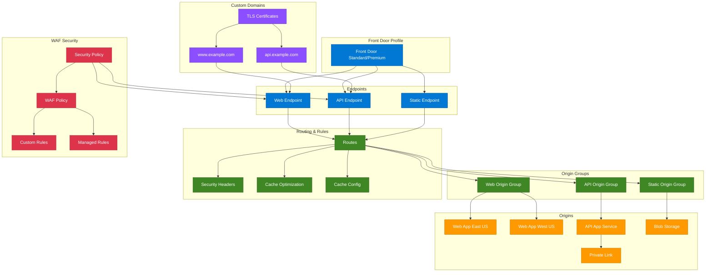

# terraform-azure-front-door

Production-ready Terraform module for deploying Azure Front Door (Standard/Premium) with origins, origin groups, routes, rule sets, WAF policies, custom domains, caching, compression, and private link origins.

## Architecture



## Usage

```hcl
module "front_door" {
  source = "path/to/terraform-azure-front-door"

  resource_group_name = "rg-front-door"
  profile_name        = "afd-prod-001"
  sku_name            = "Standard_AzureFrontDoor"

  endpoints = {
    "ep-web" = {}
  }

  origin_groups = {
    "og-web" = {
      health_probe = { path = "/", protocol = "Https" }
    }
  }

  origins = {
    "origin-webapp" = {
      origin_group_name = "og-web"
      host_name         = "mywebapp.azurewebsites.net"
    }
  }

  routes = {
    "rt-default" = {
      endpoint_name     = "ep-web"
      origin_group_name = "og-web"
    }
  }
}
```

## Examples

- [Basic](examples/basic/main.tf) - Single endpoint with one origin
- [Advanced](examples/advanced/main.tf) - Multiple endpoints, caching, compression, and rule sets
- [Complete](examples/complete/main.tf) - Full deployment with custom domains, WAF, rule sets, and Premium SKU

## Requirements

| Name | Version |
|------|---------|
| [terraform](https://www.terraform.io/) | >= 1.5.0 |
| [azurerm](https://registry.terraform.io/providers/hashicorp/azurerm/latest/docs) | >= 3.80.0 |

## Resources

| Name | Type | Documentation |
|------|------|---------------|
| [azurerm_cdn_frontdoor_profile](https://registry.terraform.io/providers/hashicorp/azurerm/latest/docs/resources/cdn_frontdoor_profile) | resource | Front Door profile |
| [azurerm_cdn_frontdoor_endpoint](https://registry.terraform.io/providers/hashicorp/azurerm/latest/docs/resources/cdn_frontdoor_endpoint) | resource | Endpoints |
| [azurerm_cdn_frontdoor_origin_group](https://registry.terraform.io/providers/hashicorp/azurerm/latest/docs/resources/cdn_frontdoor_origin_group) | resource | Origin groups |
| [azurerm_cdn_frontdoor_origin](https://registry.terraform.io/providers/hashicorp/azurerm/latest/docs/resources/cdn_frontdoor_origin) | resource | Origins |
| [azurerm_cdn_frontdoor_route](https://registry.terraform.io/providers/hashicorp/azurerm/latest/docs/resources/cdn_frontdoor_route) | resource | Routes |
| [azurerm_cdn_frontdoor_rule_set](https://registry.terraform.io/providers/hashicorp/azurerm/latest/docs/resources/cdn_frontdoor_rule_set) | resource | Rule sets |
| [azurerm_cdn_frontdoor_rule](https://registry.terraform.io/providers/hashicorp/azurerm/latest/docs/resources/cdn_frontdoor_rule) | resource | Rules |
| [azurerm_cdn_frontdoor_custom_domain](https://registry.terraform.io/providers/hashicorp/azurerm/latest/docs/resources/cdn_frontdoor_custom_domain) | resource | Custom domains |
| [azurerm_cdn_frontdoor_firewall_policy](https://registry.terraform.io/providers/hashicorp/azurerm/latest/docs/resources/cdn_frontdoor_firewall_policy) | resource | WAF policies |
| [azurerm_cdn_frontdoor_security_policy](https://registry.terraform.io/providers/hashicorp/azurerm/latest/docs/resources/cdn_frontdoor_security_policy) | resource | Security policies |

## Inputs

| Name | Description | Type | Default | Required |
|------|-------------|------|---------|----------|
| resource_group_name | Name of the resource group | `string` | n/a | yes |
| profile_name | Front Door profile name | `string` | n/a | yes |
| sku_name | SKU (Standard/Premium) | `string` | `"Standard_AzureFrontDoor"` | no |
| response_timeout_seconds | Response timeout (16-240) | `number` | `120` | no |
| endpoints | Map of endpoints | `map(object)` | `{}` | no |
| origin_groups | Map of origin groups | `map(object)` | `{}` | no |
| origins | Map of origins | `map(object)` | `{}` | no |
| routes | Map of routes | `map(object)` | `{}` | no |
| rule_sets | Map of rule sets with rules | `map(object)` | `{}` | no |
| custom_domains | Map of custom domains | `map(object)` | `{}` | no |
| waf_policies | Map of WAF policies | `map(object)` | `{}` | no |
| security_policies | Map of security policies | `map(object)` | `{}` | no |
| tags | Tags for all resources | `map(string)` | `{}` | no |

## Outputs

| Name | Description |
|------|-------------|
| profile_id | Resource ID of the Front Door profile |
| profile_name | Name of the Front Door profile |
| profile_resource_guid | Resource GUID of the profile |
| endpoint_ids | Map of endpoint names to resource IDs |
| endpoint_host_names | Map of endpoint names to host names |
| origin_group_ids | Map of origin group names to resource IDs |
| origin_ids | Map of origin names to resource IDs |
| route_ids | Map of route names to resource IDs |
| custom_domain_ids | Map of custom domain names to resource IDs |
| custom_domain_validation_tokens | Map of custom domains to validation tokens |
| rule_set_ids | Map of rule set names to resource IDs |
| waf_policy_ids | Map of WAF policy names to resource IDs |
| security_policy_ids | Map of security policy names to resource IDs |

## License

MIT License - see [LICENSE](LICENSE) for details.
